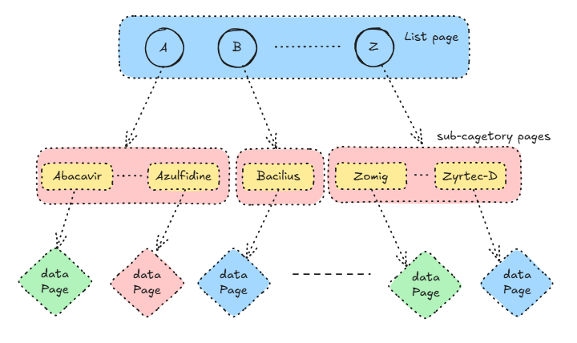
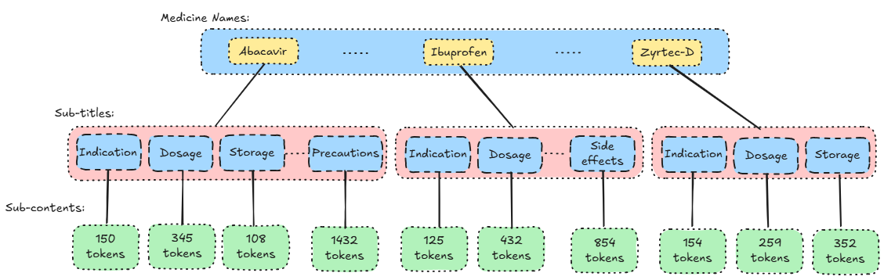
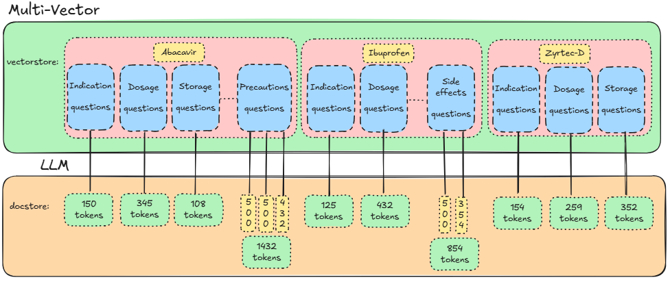

## MediPal -- 1. Data Collection
### In this section, I built a data pipeline to get medicine information from a datasource. 


The main trouble was how to get each medicine page's url. 

Fortunately, there is root page. From there I can iterately get the all the url of next layer.

So the process explores the website from root to leaf pages. It iterates through the website like traversing a tree structure.

##### Steps:

1. The process visits the root page to get the urls of the drugs name begin with letters from A to Z.

2. Then, it iterates exploring each url from step 1 to get each drug's url.

3. Finally, it extracts the drugs' information from the leaf pages and save it to json file.



JSON example:
```json
{
    "id": int,
    "drug_name": str,
    "pronunciation": str,
    "url": str,
    "subtitles": [
      {
        "title": str,
        "content": str,
      },
	  .....
      {
        "title": str,
        "content": str,
      }
    ]
}
```
---

## MediPal -- 2. Data Preprocessing

### In this section, I preprocessed the dataset:

1. **Check for Sensitive Information**

   Look for any potential PII, payment card details, or other confidential data.

   Even one piece of problematic data can spoil the entire system.

2. **Augment relationship between drug name, sub-title and sub-content**

   I found a lot of sub-titles or sub-contents have no drug's name. They contiain 'this medicine','this drug' or pronoun instead of drug name.

   It is meaningless, if I embed them to vector db. So I replaced those pronoun with drug names.

### **Review Basic Statistics**

| Metric                    | Value    |
|---------------------------|----------|
| MedicineCount             | 7,391    |
| SubContentCount           | 72,114   |
| Total words               | 9,077,218|
| MinContentLength          | 4        |
| MaxContentLength          | 2,059    |
| LessThan500WordsCount     | 70,255   |
| LargerThan500WordsCount   | 1,859    |

---

## MediPal -- 3. Data Chunking

### In this section, I implemented a proper approach to chunk the dataset based on the features of the dataset itself so that we can retrieve efficiently.

##### Main Features:
* The medicine names, sub-titles and sub-content are already semantically linked together.
* Each content is self-contained.
* The dataset has 7,391 medicines, 72,114 sub-contents and more than 9,077,218 words.
* 70,255 sub-contents have less than 500 words. Only 1,859 sub-contents are larger than 500.


### Analysis:
1. Because each content is self-contained, it means it is already chunked semantically.
2. I don't think it is an efficient way to embed all contents to vector db.
3. Instead of that, I would like to make a multi-representation retrieval strategy which means I only need to embed abstract part of the dataset.
### Plan:
1. Since I'm building a medical Q&A agent, I will use a LLM to generate questions based on each sub-content, then embed sub-titles and questions in the vector, and store the corresponding sub-contents in the docstore. 
2. When a query comes, it will similarity search the closest sub-titles or questions, and the output is the linked sub-content.
3. In order to allow LLM to generate higher quality questions based on the content, I decided to split the content larger than 500 words into less than 500 words.



---

## MediPal -- 4. Questions Generating

### In this section, I involve a medical-domain LLM(Bio-Medical-Llama-3-8B) as a question-generator to create questions based on the sub-contents.


#### Why I choose ContactDoctor/Bio-Medical-Llama-3-8B?

##### 1. Because OpenAI API will cost me a lot of money, since I have more than 9 million words to process. Local LLM might cost less.
##### 2. Because I tested three LLMs before I found it could generate high quality medical question based on medical contents. This is the only task it can do better than Meta-Llama-3-8B-Instruct. See the result below or the Test_and_Select_LLM.ipynb:

#### Task 2: Generate questions based on given content
| LLM                                   | Question Quality | Structured_output  | 
|---------------------------------------|------------------|--------------------|
| meta-llama/Llama-3.2-1B-Instruct      | Bad👎            | Bad👎              | 
| meta-llama/Meta-Llama-3-8B-Instruct   | Good👌           | Amazing👍          | 
| ContactDoctor/Bio-Medical-Llama-3-8B  | Amazing👍        | Good👌              | 

#### The only problem the LLM made was the output was not stable. No matter how I improved the prompt, it still sometimes generated questions in unexpected format.

Solution: I put StrOutputParser in the chain to output string, then put my own parser at the end to extract questions with regex from the string like (prompt | question_generator | StrOutputParser() | RunnableLambda(parse_questions))

Result: It took a few hours to generated 203,953 questions in total.