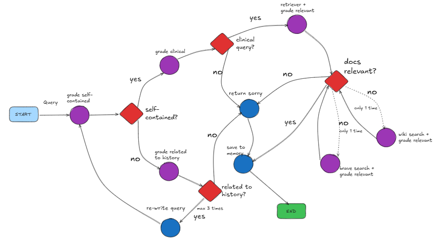

## MediPal -- 1. Multi-Vector Retriever with rerank

### In this section, I built a multi-vector retriever with Re-rank mechanism

In the previous section, I used a medical-domain LLM to generate questions from multiple perspectives based on the given content.

As planned, I implemented a Multi-Vector architecture as the foundation of the RAG application.

Here’s what I did:

* Embedded the generated questions into the vector store and stored the corresponding documents in the doc store.

* Used the doc_id, to establish a link between the vector store and the doc store.

* Applied a cross-encoder to re-rank the retrieved documents and improve retrieval precision.

---

## MediPal -- 2. Add Agentic Elements

### In this section, I added agentic elements to the multi-vector retriever to make it an agentic retriever for medical documents.

Why I need **Agentic elements**?

Becuase normal retriever can only search similar documents by query. If the query contains no relevant information, it is not able to retrieve right documents.

##### **Problem description**:

In real life conversation, users ask unpredictable questions. 

For example:
In the third turn, the user really want to ask 'How do I take Phenylephrine?'

But he inputs 'How do I take it?'. From the context, 'it' means 'Phenylephrine'.

If we retrieve documents by query 'How do I take it?', we would get unrelevant document. 'How do I take Phenylephrine?' makes more sense.

Other scenarios:

1. The users might just greet or speak without any question.
2. User might ask a random question in the middle of conversation.
3. .........

##### Analysis:

**The root problem is:** 
1. How to determine whether a query is a clinial/medical query?
2. How to convert an unclear query into a self-contained one, if the query is related to previous conversation.

##### Solution:

1. I decomposed this problem into a series of yes/no questions so that retrieval process go to the right direction.   
2. I equiped LLM with memory to evaluate current situation and decide what to do next, until reaching the end.

##### The biggest trouble is how to make a good prompt for each evaluation note.

Approach was working with ChatGPT to improve prompts and test, until got ones.

---

## MediPal -- 3. Agentic RAG(MediPal)

### In this section, I added the master agent on top of the 'agentic retriever', and wrapped up everything under the name “MediPal.”
##### Design
1. The master agent can call tools. The 'agentic retriever' is just one of its tools.
2. It focuses on handling medical/clinical questions based on retrieved documents. However, it can also talk about general, non-medical topics when needed.
3. It checks hallucination after generating answer. 
4. In the future, MediPal will leverage multiple tools to support users in the medical domain. For example, it can summarize conversations and save them to Notion, or even help schedule an appointment with a doctor.

---

## MediPal -- 4. Frontend -- API and Chatbox

### In this section
* I built an API endpoint by fastapi so that we only needs to launch the heavy process once. Other frontend apps just need to interact with the api. 
* I also built an chatbox with Gradio which can interact user by voice and text message. 

Key techniques: whisper, gtts, fastapi, gradio, unicorn

##### The hardest part of this section should be deploying the whole thing to a inference platform or Cloud platform. That is is other domain. I will dive into it in later notebook.

---

## MediPal -- 5. Evaluation -- RAGAS

### In this section, I evaluate MediPal by RAGAS. I keep everything the same but change models to see the differents. 

##### I set exact the same evaluation dataset, metrics, model setting and environment to compare three models.

| Medicial Expert      |  Normal Guy                     |  Big  Model                      |
| -------------------- | ------------------------------- |--------------------------------- |
| ContactDoctor/Bio-Medical-Llama-3-8B | meta-llama/Meta-Llama-3-8B-Instruct | meta-llama/Meta-Llama-3-70B-Instruct |

##### Metrics: answer_relevancy, faithfulness, context_precision, context_recall
**RAG metrics:** [RAG metrics](https://docs.ragas.io/en/stable/concepts/metrics/available_metrics/)

##### Hardest part should be the optimization I do based on the result. As the time limitation, I didn't do much about it. But I will do more.

* For example, if context_precision and context_recall was low, I should think about how to improve the retriever part like chunking, indexing, query translation, tools...
* If the answer_relevancy and faithfulness was bad, I should should optimize the generator part like better prompting, better LLMs...
* Do evaluation -> improvement -> evaluation ->... until reach the goal.

### Results:

| LLM                                   | faithfulness | answer_relevancy  | context_precision  | context_recall  |
|---------------------------------------|--------------|-------------------|--------------------|-----------------|
| ContactDoctor/Bio-Medical-Llama-3-8B  |  0.5636 | 0.9085 | 0.7586 | 0.7069 |
| meta-llama/Meta-Llama-3-8B-Instruct   |  0.8645 | 0.8018 | 0.7586 | 0.7069 |
| meta-llama/Meta-Llama-3-70B-Instruct   |  xx | xx | xx | xx |

*I still didn't evaluate 70B model, as my GPU is not big. I will use small quantilization or llama.cpp gguf 4-bit to try.

### Summary:

* Meta-Llama-3-8B-Instruct → More faithful and reliable.

* Bio-Medical-Llama-3-8B → More contextually relevant and human-like.