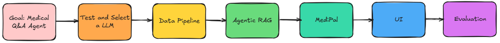

<div style="display: flex; align-items: flex-start;">
  <div style="flex: 0 0 150px;">
    
  </div>
  <div style="flex: 1; padding-left: 15px;">
    <p>
      <b>MediPal</b> is your AI friend for medical and clinical Q&A. 
      <ul>
         <li>It is an open-source medical assistant that provides comprehensive mediciation information and symptom-based recommendations using natural-language understanding which supports voice and message conversation.</li>
         <li>Powered by local Huggingface LLMs, embedding model, cross-encoder(BERT) and whisper with AI Agent development frameworks like langchain, langgraph and many tools. </li>
      </ul>
    </p>
  </div>
</div>

---

## Motivation
1. **Easy examples with big LLM**

Recently, I tried to implement a medical Q&A agent, I saw that many code examples use big models like gpt-4o. With a few lines of code, I can get pretty good results.

2. **Not good for deeper learning**

This is good to learn how to use AI frameworks/tools, but it does not help me understand why and how gpt can do this. For example: How does it do reasoning? How does it break down a task? How does it use tools? How could its talks are always linked to previous conversations?

3. **Real project limits**

In real projects, we often has limited resource, as we need to manage cost and keep data security. Sometimes we must use small local models.

#### So this project is not to build a very fancy and powerful AI application, instead **My main motivation is** to use small local models do similar Q&A task just like a big model do. 

---

## Development Process



---

## Design
MediPal is designed to have:

1. **Comprehensive Medicine Knowledge Base**

   * I built an **Agentic RAG** to provide relevant and accurate information for responses.

2. **Evaluation and Decision Patterns**

   * Instead of solving a problem at once, it is better to break the problem into small yes-or-no questions. 
   * The model can evaluate and decide what to do next. By repeating this process, until solve a problem correctly.

3. **Conversation Memory**

   * Remembers previous conversations, so that its talks can always stay connected with the context.

4. **External tools**

   * Calls wikipedia or brave search tools when needed.

---

## Project Structure
The project is organized into five stages:

1. **Data ETL Pipeline**

   * Scrapes data from medicine websites.
   * Preprocesses the data and analysis.
   * Implements properly chunking strategy.
   * Generates extra questions using local LLM.

2. **Agentic RAG**

   * Combineds multi-vector retriever and re-ranking techniques to enhance retrieval efficiency and accuracy.
   * Add agentic elements and decomposes retrieval task into a series of yes/no questions so that the process go to the right direction.
   * Calls external tools when no relevant documents are found in the local vector database.

3. **MediPal - Medical Q&A Agent**

   * Generates answers based on the retrieval documents with halluciation checking.
   * Interacts with users on other topics, but emphasizes its primary role is to provide medical information.
   * leverages external tools or MCP services to support users in the medical domain. For example, it can analysize and summarize conversations, then save them to Notion, or even help schedule an appointment with a doctor (Future stage!).

4. **FrontEnd**

   * Places Medipal under a API endpoint, so that we only needs to launch it once. Other apps just need to interact with the api.
   * Provides a chat interface that supports both text and voice conversations.

5. **Evaluation**

   * I set exact the same evaluation dataset, matrics and environment, comparing two sets of models. They have almost the same size but one set is general models, another one is fine-tuned on medical documents.

| Medical Team      |  General Team                      |
| ----------------- | ---------------------------------- |
| sentence-transformers/embeddinggemma-300m-medical | google/embeddinggemma-300m |
| ncbi/MedCPT-Cross-Encoder | cross-encoder/ms-marco-MiniLM-L6-v2 |
| ContactDoctor/Bio-Medical-Llama-3-8B | meta-llama/Meta-Llama-3-8B-Instruct |
  
```text
MediPal/
├─ 1_LLM_Selection/                # Key Techniques/Tools: Langchain, Prompt Engineering, HuggingFace(transformers)
│  ├─ README.md
│  ├─ Test_and_Select_LLM.ipynb
│  ├─ utils/
│  │  └─ mytools.py 
│  └─ .env
│
├─ 2_DataPipeline/                 # Key Techniques/Tools: bs4.BeautifulSoup, Regex, matplotlib, Langchain, transformers
│  ├─ README.md
│  ├─ 1_Medicine_data_collection.ipynb
│  ├─ 2_Medicine_data_preprocessing_analysis.ipynb
│  ├─ 3_Medicine_data_chunking.ipynb
│  ├─ 4_Medicine_data_generate_questions.ipynb
│  ├─ utils/
│  │  └─ mytools.py 
│  ├─ datasets/*.json              # Scraped, cleaned, chunked and augmented dataset
│  └─ .env
│
├─ 3_AgenticRAG/                   # Key Techniques/Tools: Muilti-Vector, Chroma, CrossEncoder(BERT), Embedding Model, LLM, Memory, langgraph, Langchain, transformers, torch, 
│  ├─ README.md                    # wikipadia, brave search, logging, whisper, gtts, fastapi, gradio, unicorn, RAGAS  
│  ├─ 1_Rerank_Retriever.ipynb
│  ├─ 2_Agentic_RAG.ipynb
│  ├─ 3_MediPal.ipynb
│  ├─ 4_API_Chatbox.ipynb
│  ├─ 5_Evaluation.ipynb
│  ├─ src/
│  │  ├─ rerank_retriever.py
│  │  ├─ agentic_rag.py
│  │  ├─ medipal.py
│  │  ├─ settings.py
│  │  └─ datasets/*.json
│  ├─ utils/
│  │  └─ mytools.py 
│  └─ .env
│
├─ src/                            # Moved and restructed all the codes from jupyter notebooks to src files
│  ├─ retriever/
│  │  ├─ rerank_retriever.py
│  │  └─ datasets/*.json
│  ├─ agenticrag/
│  │  └─ agentic_rag.py
│  ├─ medipal/
│  │  └─ medipal.py
│  ├─ config/
│  │  └─ settings.py
│  ├─ utils/
│  │  └─ mytools.py 
│  └─ __init__.py  
│
├─ assets/ 
│  ├─ screenshots/                   # Pictures
│  └─ *.PNG
│
├─ medipal_api.py
│
├─ medipal_chatbox.py
│
├─ .env
│
├─ Requirements.txt
│
├─ LICENSE
│
└─ README.md                       # Main project overview

````

## Dataset 

Only two sample medicine entries (manually processed) are included in this repo to show the data structure and help run the code.
For full data scraping with 1_Medicine_data_collection.ipynb, please read the disclaimer first.

---

## 🚀 Getting Started

### Prerequisites

List all software or tools required.

```bash
# Example
python >= 3.11
```

### Installation

Step-by-step guide:

```bash
git clone https://github.com/yourname/yourproject.git
cd yourproject
pip install -r requirements.txt
```

---

## 🖥 Usage

Provide clear examples:

```bash
python src/main.py --config config.yaml
```

You can also show **inline code** like `python main.py` within a sentence.

---

## ⚙️ Configuration

.env files

| Variable      | Description              | Default |
| ------------- | ------------------------ | ------- |
| `HUGGINGFACE_KEY`| Your own huggingface key like "hf_xxxxxxxxxxxxxxxx" | None    |

---

## 🔗 Links

* **Documentation:** [Project Docs](https://example.com/docs)
* **Demo:** [Live Demo](https://example.com/demo)

---

## 🧩 Examples

Embed different code languages:

<details>
<summary>Python</summary>

```python
from yourmodule import run
run()
```

</details>

<details>
<summary>JavaScript</summary>

```javascript
import { run } from 'yourmodule';
run();
```

</details>

---

## ✅ Tests

```bash
pytest tests/
```

---

## 🛣 Roadmap

* [ ] Add authentication
* [ ] Implement CI/CD
* [ ] Multi-language support

See the [open issues](https://github.com/yourname/yourproject/issues) for full list.

---

## 🤝 Contributing

1. Fork the Project
2. Create your Feature Branch (`git checkout -b feature/AmazingFeature`)
3. Commit your Changes (`git commit -m 'Add some AmazingFeature'`)
4. Push to the Branch (`git push origin feature/AmazingFeature`)
5. Open a Pull Request

---

## 📜 License

Distributed under the MIT License. See `LICENSE` for more information.

---

## 🙏 Acknowledgements

* [Awesome Library](https://github.com/some/library)
* [Inspiration Blog Post](https://example.com)

---

### Markdown Tips & Samples

| Element           | Syntax Example                     |
| ----------------- | ---------------------------------- |
| **Bold**          | `**text**`                         |
| *Italic*          | `*text*`                           |
| ~~Strikethrough~~ | `~~text~~`                         |
| Blockquote        | `> quoted text`                    |
| Checklist         | `- [ ] item` or `- [x] done`       |
| Link              | `[title](URL)`                     |
| Image             | ``              |
| Footnote[^1]      | `Here is a footnote reference[^1]` |

---

## Table of Contents
- [Motivation](#motivation)
- [Features](#features)
- [Project Structure](#project-structure)
- [Getting Started](#getting-started)
  - [Prerequisites](#prerequisites)
  - [Installation](#installation)
- [Usage](#usage)
- [Configuration](#configuration)
- [Examples](#examples)
- [Tests](#tests)
- [Roadmap](#roadmap)
- [Contributing](#contributing)
- [License](#license)
- [Acknowledgements](#acknowledgements)

---

## Citation:

**Data Source:** Content obtained from MedlinePlus(https://medlineplus.gov/), a service of the U.S. National Library of Medicine (NLM), National Institutes of Health (NIH). Courtesy of the National Library of Medicine.

@misc{ContactDoctor_Bio-Medical-Llama-3-8B, author = ContactDoctor, title = {ContactDoctor-Bio-Medical: A High-Performance Biomedical Language Model}, year = {2024}, howpublished = {https://huggingface.co/ContactDoctor/Bio-Medical-Llama-3-8B}, }

@inproceedings{reimers-2019-sentence-bert,
    title = "Sentence-BERT: Sentence Embeddings using Siamese BERT-Networks",
    author = "Reimers, Nils and Gurevych, Iryna",
    booktitle = "Proceedings of the 2019 Conference on Empirical Methods in Natural Language Processing",
    month = "11",
    year = "2019",
    publisher = "Association for Computational Linguistics",
    url = "https://arxiv.org/abs/1908.10084",
}

@misc{gao2021scaling,
    title={Scaling Deep Contrastive Learning Batch Size under Memory Limited Setup},
    author={Luyu Gao and Yunyi Zhang and Jiawei Han and Jamie Callan},
    year={2021},
    eprint={2101.06983},
    archivePrefix={arXiv},
    primaryClass={cs.LG}
}

@article{jin2023medcpt,
  title={MedCPT: Contrastive Pre-trained Transformers with large-scale PubMed search logs for zero-shot biomedical information retrieval},
  author={Jin, Qiao and Kim, Won and Chen, Qingyu and Comeau, Donald C and Yeganova, Lana and Wilbur, W John and Lu, Zhiyong},
  journal={Bioinformatics},
  volume={39},
  number={11},
  pages={btad651},
  year={2023},
  publisher={Oxford University Press}
}

---

## Disclaimer: 
This project provides code for scraping content from MedlinePlus, a service of the U.S. National Library of Medicine (NLM), National Institutes of Health (NIH).

Some MedlinePlus materials are in the public domain and may be reused freely with proper attribution. However, other materials (such as certain drug monographs, encyclopedia articles, and images) are copyrighted or licensed for use only on MedlinePlus.

By using this code, you are responsible for ensuring that your use of MedlinePlus content complies with NLM policies and applicable copyright laws.

Source attribution: “Courtesy of MedlinePlus from the National Library of Medicine (NLM), National Institutes of Health (NIH).”