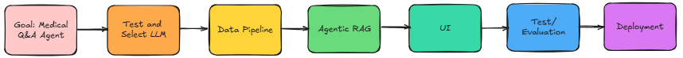

**MediPal** is your AI friend for medical and clinical Q&A.
* It is an open-source medical assistant that provides comprehensive mediciation information and symptom-based recommendations using natural-language understanding which supports voice and message conversation.

* Powered by local Huggingface LLMs, embedding model, cross-encoder(BERT) and whisper with AI Agent development frameworks like langchain, langgraph and many tools.

---

## Motivation
1. **Easy examples with big LLM**

Recently, I tried to make a medical Q&A agent, I saw that many code examples use big models like gpt-4o. With a few lines of code, I can get pretty good user experience.

2. **Not good for learning**

This is good to learn how to use AI frameworks/tools, but it does not help me understand why and how gpt can do this. For example: How could it reason? How could it use tools? Why could its talks are always linked to previous conversations?

3. **Real project limits**

In real projects, we often has limited resource, as we need to manage cost and keep data security. Sometimes we must use small local models to build AI application. Those models usually doesn't have the same capability as gpt-4o has.

#### So this project is not to build a very fancy and powerful AI application, instead **My main motivation is** to build a Q&A agent using small local models. But it can give us similar user experience. 

---

## Main Components

MediPal is designed to have:

1. **Comprehensive Medicine Knowledge Base**

   * I built an **Agentic RAG** to provide relevant and accurate information for responses.

2. **Evaluation and Decision Patterns**

   * Instead of solving a problem at once, I decomposed a problem into small yes-or-no questions. 
   * The model can evaluate and decide what to do next. By repeating this process, until solve a problem correctly.

3. **Conversation Memory**

   * Remembers previous conversations, so that its talks always stay connected with the context.

4. **External tools**

   * Calls wikipedia or brave search tools when needed.

---

## Development Process



---

## Project Structure
The project is organized into six stages. The Jupyter notebooks mainly show the implementation process at each stage. After completing each stage, I reorganized the code into Python files. Each stage makes use of the Python files and data results from the previous stage.

1. **[LLMs selections](https://github.com/Montreal-JieZhu/MediPal/tree/main/1_LLM_Selection)**

   * Test and compares three small LLMs.
   * Analyze their strenghts and weaknesses so that I can use the right one for the project.

2. **[Data ETL Pipeline](https://github.com/Montreal-JieZhu/MediPal/tree/main/2_DataPipeline)**

   * Scrape data from medicine websites.
   * Preprocess the data and analysis.
   * Implement properly chunking strategy.
   * Generate extra questions using local LLM.

3. **[Agentic RAG](https://github.com/Montreal-JieZhu/MediPal/tree/main/3_AgenticRAG)**

   * Combine multi-vector retriever and re-ranking techniques to enhance retrieval efficiency and accuracy.
   * Add agentic elements and decomposes retrieval task into a series of yes/no questions so that the process go to the right direction.
   * Call external tools when no relevant documents are found in the local vector database.

4. **[MediPal - Medical Q&A Agent](https://github.com/Montreal-JieZhu/MediPal/tree/main/3_AgenticRAG)**

   * Generate answers based on the retrieval documents with halluciation checking.
   * Interact with users on other topics, but emphasizes its primary role is to provide medical information.
   * leverage external tools or MCP services to support users in the medical domain. For example, it can analysize and summarize conversations, then save them to Notion, or even help schedule an appointment with a doctor (Future stage!).

5. **[FrontEnd](https://github.com/Montreal-JieZhu/MediPal/tree/main/3_AgenticRAG)**

   * Place Medipal under a API endpoint, so that we only needs to launch it once. Other apps just need to interact with the api.
   * Provide a chat interface that supports both text and voice conversations.

6. **[Evaluation](https://github.com/Montreal-JieZhu/MediPal/tree/main/3_AgenticRAG)**

   * Evaluate MediPal by RAGAS. I changed different LLMs to compare the results. 

| Medicial Expert      |  Normal Guy                     |  Big  Model                      |
| ----------------- | ---------------------------------- |---------------------------------- |
| ContactDoctor/Bio-Medical-Llama-3-8B | meta-llama/Meta-Llama-3-8B-Instruct | meta-llama/Meta-Llama-3-70B-Instruct |
  
```text
MediPal/
├─ 1_LLM_Selection/                # Tech: Langchain, Prompt Engineering, HuggingFace 
│  ├─ README.md                            
│  ├─ Test_and_Select_LLM.ipynb
│  └─ .env
├─ 2_DataPipeline/                 # Tech: bs4.BeautifulSoup, Regex, matplotlib, Langchain，
│  ├─ README.md                            transformers, pydantic
│  ├─ 1_Medicine_data_collection.ipynb
│  ├─ 2_Medicine_data_preprocessing_analysis.ipynb
│  ├─ 3_Medicine_data_chunking.ipynb
│  ├─ 4_Medicine_data_generate_questions.ipynb
│  ├─ utils/
│  │  └─ mytools.py 
│  ├─ datasets/*.json              
│  └─ .env
├─ 3_AgenticRAG/                   # Tech: Muilti-Vector, Chroma, CrossEncoder(BERT), Embedding, LCEL 
│  ├─ README.md                            LLM, Memory, langgraph, Langchain, pydantic, prompting，
│  ├─ 1_Rerank_Retriever.ipynb             OutputPasers, transformers, PyTorch, typing, wikipadia, 
│  ├─ 2_Agentic_RAG.ipynb                  brave search，RAGAS, logging, whisper, gtts, fastapi, gradio, uvicorn   
│  ├─ 3_MediPal.ipynb
│  ├─ 4_API_Chatbox.ipynb
│  ├─ 5_Evaluation.ipynb
│  ├─ src/                        
│  │  ├─ rerank_retriever.py
│  │  ├─ agentic_rag.py
│  │  ├─ medipal.py
│  │  ├─ settings.py
│  │  ├─ mytools.py
│  │  └─ datasets/*.json
│  └─ .env
├─ src/                            # Moved and restructed all the codes from jupyter notebooks to src files
│  ├─ retriever/
│  │  ├─ rerank_retriever.py
│  │  └─ datasets/*.json
│  ├─ agenticrag/
│  │  └─ agentic_rag.py
│  ├─ medipal/
│  │  └─ medipal.py
│  ├─ config/
│  │  └─ settings.py
│  ├─ utils/
│  │  └─ mytools.py 
│  └─ __init__.py  
├─ assets/ 
│  └─ screenshots/                 # Pictures
│     └─ *.PNG  
├─ medipal_api.py
├─ medipal_chatbox.py
├─ .env
├─ Requirements.txt
├─ pyproject.toml
├─ uv.lock
├─ Requirements.txt
├─ LICENSE
└─ README.md                       # Main project overview

````

## Dataset 

Only three sample medicine entries (manually processed) are included in this repo to show the data structure and help run the code.
For full data collection with 1_Medicine_data_collection.ipynb, please read the disclaimer first.

---

## 🚀 Getting Started

### Prerequisites

| GPU                  | CUDA      | Pytorch    | Linux              | python  |
| -------------------- | --------- | ---------- | ------------------ | ------- |
| NVIDIA-SMI 565.57.01 | 12.7      | 2.8        | Ubuntu 22.04.4 LTS | 3.11    |

### Installation

Step 1: Clone repository

```
git clone https://github.com/Montreal-JieZhu/MediPal.git
cd MediPal
```

Step 2: Setup python environment

If you have **uv  -- one cmd done**

```
uv sync
```

Python:
```
python -m venv venv
```
Conda:
```
conda create -n venv python=3.11
```

Activate environment

Linux/macOS:
```
source venv/bin/activate
```

Windows: 
```
venv\Scripts\activate
```

Conda:
```
conda activate venv
```

Step 3: Install requirements

```
pip install -r requirements.txt
```

---

## 🖥 Usage

Step 1: Launch API endpoint

```bash
python -m medipal_api
```

Step 2: Launch Chatbox

```bash
python -m medipal_chatbox
```

Step 3: Copy and paste **http://127.0.0.1:30001** into browser

---

## ⚙️ Configuration

.env files

| Variable      | Description              | Default |
| ------------- | ------------------------ | ------- |
| `HUGGINGFACE_KEY`| Your own huggingface key like "hf_xxxxxxxxxxxxxxxx" | None    |

---

## Demo

[](assets/video/demo.mp4)

---

## Citation:

**Data Source:** Content obtained from MedlinePlus(https://medlineplus.gov/), a service of the U.S. National Library of Medicine (NLM), National Institutes of Health (NIH). Courtesy of the National Library of Medicine.

@misc{ContactDoctor_Bio-Medical-Llama-3-8B, author = ContactDoctor, title = {ContactDoctor-Bio-Medical: A High-Performance Biomedical Language Model}, year = {2024}, howpublished = {https://huggingface.co/ContactDoctor/Bio-Medical-Llama-3-8B}, }

@inproceedings{reimers-2019-sentence-bert,
    title = "Sentence-BERT: Sentence Embeddings using Siamese BERT-Networks",
    author = "Reimers, Nils and Gurevych, Iryna",
    booktitle = "Proceedings of the 2019 Conference on Empirical Methods in Natural Language Processing",
    month = "11",
    year = "2019",
    publisher = "Association for Computational Linguistics",
    url = "https://arxiv.org/abs/1908.10084",
}

@misc{gao2021scaling,
    title={Scaling Deep Contrastive Learning Batch Size under Memory Limited Setup},
    author={Luyu Gao and Yunyi Zhang and Jiawei Han and Jamie Callan},
    year={2021},
    eprint={2101.06983},
    archivePrefix={arXiv},
    primaryClass={cs.LG}
}

@article{jin2023medcpt,
  title={MedCPT: Contrastive Pre-trained Transformers with large-scale PubMed search logs for zero-shot biomedical information retrieval},
  author={Jin, Qiao and Kim, Won and Chen, Qingyu and Comeau, Donald C and Yeganova, Lana and Wilbur, W John and Lu, Zhiyong},
  journal={Bioinformatics},
  volume={39},
  number={11},
  pages={btad651},
  year={2023},
  publisher={Oxford University Press}
}

---

## Disclaimer: 
This project provides code for scraping content from MedlinePlus, a service of the U.S. National Library of Medicine (NLM), National Institutes of Health (NIH).

Some MedlinePlus materials are in the public domain and may be reused freely with proper attribution. However, other materials (such as certain drug monographs, encyclopedia articles, and images) are copyrighted or licensed for use only on MedlinePlus.

This code only involves content in the public domain. If you use or modify this code to access any materials, please ensure that your use of MedlinePlus content complies with NLM policies and applicable copyright laws.

Source attribution: “Courtesy of MedlinePlus from the National Library of Medicine (NLM), National Institutes of Health (NIH).”